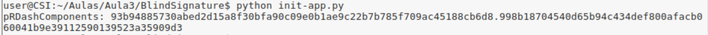
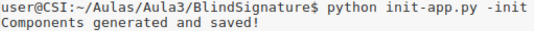
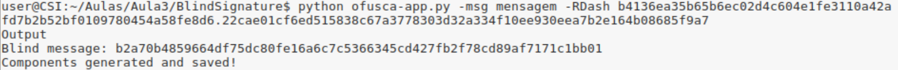
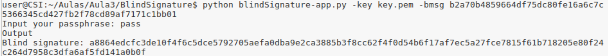
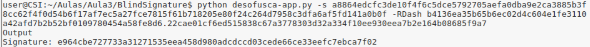
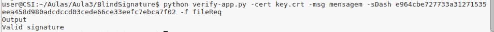

## Exercício 1

Primeiramente realizámos as experiências propostas no enunciado em que foi criado um certificado baseado no algoritmo de 
curvas elípticas e foi-se manipulando o processo de assinatura cega. De seguida, encontra-se a resolução da pergunta 1.1 que
pedia para alterar o código das componentes da assinatura cega de forma a simplificar o input e output.

### Pergunta 1.1
O código fonte encontra-se na pasta `BlindSignature`.

**Inicialização**

O módulo `init-app.py` pode ser ser executado de uma das seguintes formas:
- `python init-app.py`, que devolve as _pRDashComponents_.
- `python init-app.py -init`, que inicializa as componentes _initComponents_ e _pRDashComponents_ , 
guardando-as num ficheiro com o nome `fileSigner`.

Execução utilizando o comando `python init-app.py`

Execução utilizando o comando `python init-app.py -init`

**Ofuscação**

O módulo `ofusca-app.py` deve ser executado da seguinte forma:
- `python ofusca-app.py -msg <mensagem_a_assinar> -RDash <pRDashComponents>`, que devolve a _blind message_ e 
guarda as _blind components_ e as _pRComponents_ num ficheiro do requerente com o de `fileReq`.

Execução utilizando o comando `python ofusca-app -msg <mensagem> -RDash <pRDashComponents>`.

**Assinatura**

O módulo `blindSignature-app.py` deve ser executado da seguinte forma:
- `python blindSignature-app.py -key <chave_privada> -bmsg <blind_message>`, que devolve a _blind signature_ executada.

Execução utilizando o comando `python blindSignature-app.py -key <chave_privada> -bmsg <blind_message>`.

**Desofuscação**

O módulo `desofusca-app.py` deve ser executado da seguinte forma:
- `python desofusca-app.py -s <blind_signature> -RDash <pRDashComponents>`, que a 
assinatura retirada da _blind signature_.

Execução utilizando o comando `python desofusca-app.py -s <blind_signature> -RDash <pRDashComponents>`.

**Verificação**

O módulo `verify-app.py` deve ser executado da seguinte forma:
- `python verify-app.py -cert <certificado_assinante> -msg <mensagem_original_a_assinar> -sDash <signature> -f 
<ficheiro_requerente>`, que retorna a informação sobre a validade da assinatura.

Execução utilizando um comando correto e uma assinatura correcta.

