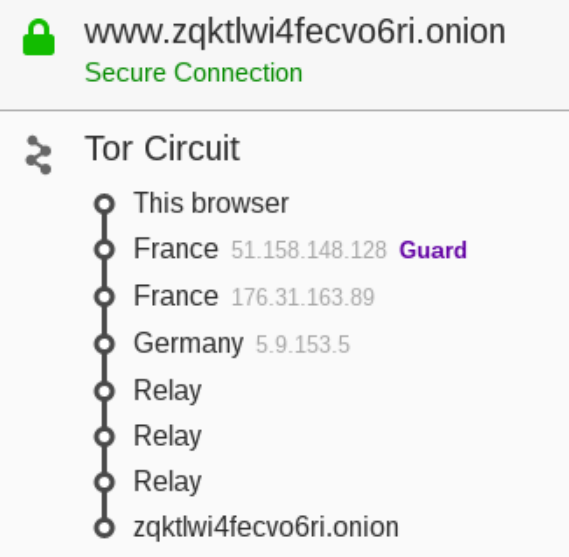

### Pergunta P1.1

##### 1

Com a execução do comando `sudo anonsurf start` não se consegue garantir que está localizado nos EUA, pois através do mesmo é
criada uma conexão do IP para a rede TOR. Como consequência, não é permitido descobrir a sua localização, garantindo-se,no
entanto, o anonimato.

##### 2

Não é possível encontrar a localização pois esta ferramenta é responsável por garantir o anonimato utilizando, para isso,
o protocolo TOR que envia todo o tráfego para esta rede. O comando é encarregue de gerar um IP novo para esconder o IP 
verdadeiro, deste modo, torna-se impossível confirmar qual será o novo IP e a respetiva localização, neste caso dos EUA.

### Pergunta P1.2

##### 1

Após abrir o browser TOR e aceder à página http://zqktlwi4fecvo6ri.onion/wiki/index.php/Main_Page e clicando no lado esquerdo da barra URL como proposto, verificamos o seguinte circuito para o respetivo site:

    

##### 2

O utilizador começa por aceder ao Directory Server de forma a obter a informação relativa aos Introduction Points (IP) e a 
chave pública do serviço anónimo, para conseguir aceder ao serviço anónimo. 
Posto isto, é criado um circuito TOR até um rendez-vous point (RP) para a conexão com o serviço anónimo em que é fornecido um 
rendez-vous cookie, isto é, um único segredo aleatório para ser possível o reconhecimento do serviço anónimo.
É assim aberta uma stream até um dos IP's do serviço anónimo pelo utilizador enviando uma mensagem cifrada com a chave pública 
referida em cima com a informação relativa ao RP, com o rendez-vous cookie e ainda uma parte da chave de sessão Diffie-Hellman.
O serviço anónimo, para responder ao utilizador, constrói um circuito TOR até ao RP do utilizador, enviando uma mensagem com o 
rendez-vous cookie, o Hash da chave partilhada e a sua parte da chave Diffie-Hellman. 

Desta forma, existe um circuito de 6 OR's em que tanto o utilizador como o serviço anónimo têm conhecimento de metade do 
circuito. Assim, o utilizador do serviço anónimo possui a informação dos 3 OR's até ao RP contudo, a partir daí, os saltos são 
Relay como vimos pois o utilizador não tem conhecimento destes. Por fim existem 3 saltos Relay dado que o circuito TOR do RP 
até ao serviço anónimo é de 3 OR's.
