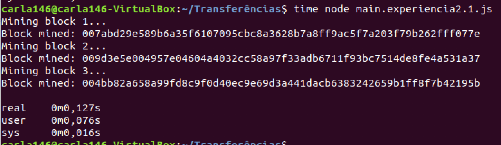
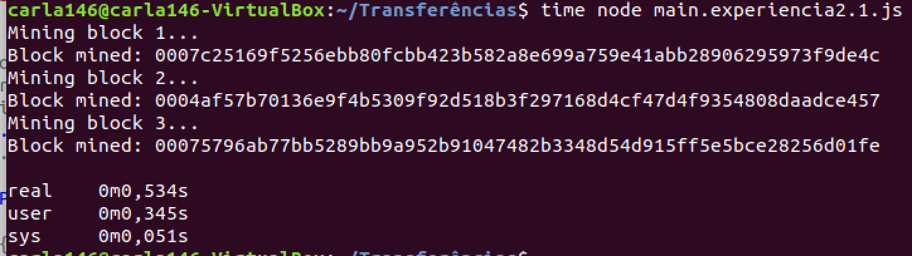
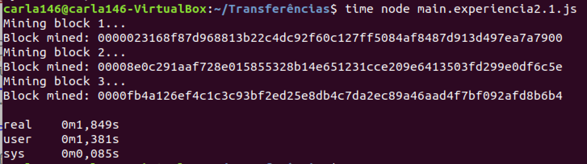
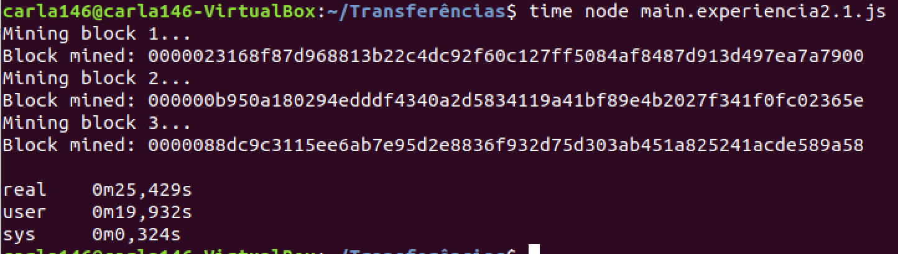

# Proof of Work Consensus Model

## Pergunta 2.1

Para responder a esta primeira questão, era necessário alterar a dificuldade de minerar para 2 e veja qual o tempo que demora, 
e repetir o processo para a dificuldade de minerar 3, 4 e 5. De seguida, apresentamos em que zona do código alteramos este 
valor antes da compilação e da observação de resultados. No exemplo a dificuldade é 2, utilizada para a primeira experiência e 
depois fomos alterando esse valor:

```
constructor(){
        this.chain = [this.createGenesisBlock()];
        this.difficulty = 2;
    }
```

- **Dificuldade 2**

<p align="center">
    
</p>

- **Dificuldade 3**

<p align="center">
    
</p>

- **Dificuldade 4**

<p align="center">
    
</p>

- **Dificuldade 5**

<p align="center">
    
</p>


Após ser feita a observação das experiências realizadas, é possível constatar que à medida que a dificuldade aumenta, o tempo 
para mineração dos blocos também aumenta. A dificuldade é traduzida pelo número de zeros pela qual a hash começa, ou seja, 
quanto maior a dificuldade, maior o número de zeros. Com isto, quanto maior a dificuldade também iremos ter um maior tempo e 
poder computacional gasto para cada criação de novos blocos.

## Pergunta 2.2

### 1

Um algoritmo Proof of Work é essencialmente um algoritmo que gera um item difícil de criar, mas fácil de verificar. O algoritmo 
que foi utilizado no SnakeCoin é simples de perceber. Para criar um novo bloco, cada miner terá de incrementar um número. 
Quando esse número é divisível por 9 (o número de caracteres em “SnakeCoin”) e o número de prova do último bloco, um novo bloco 
de SnakeCoin irá ser extraído e o miner receberá um novo SnakeCoin.

### 2

O algoritmo utilizado não é o mais adequado porque não é possível definir a dificuldade do puzzle. Um fator importante e que 
faz com que este algoritmo não seja o mais adequadp é cálculo da prova ser realizado através da prova anterior, o que permite 
realizar facilmente o cálculo das provas dos blocos antes que estes sejam publicados. Por fim, consideramos que existe 
dificuldade em encontrar um número divisível por 9 e pelo número do último PoW, levando assim a que seja necessário um elevado 
poder computacional para publicar blocos quando a Blockchain já é grande.
