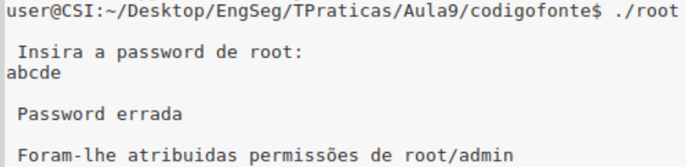
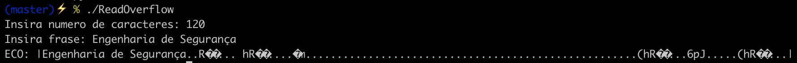
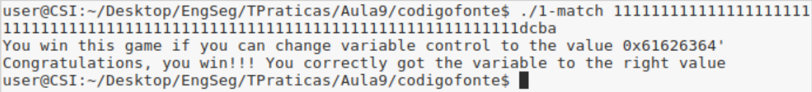

# Buffer Overflow

## Pegunta 1.1 - Buffer overflow em várias linguagens

Para os programas escritos em Java (LOverflow2.java) e em Python (LOverflow2.py), caso se introduza um valor superior em relação ao tamanho com que o array é inicializado (10), ambos terminam com um erro. 

Relativamente ao programa escrito em C++, com base nos inputs, é possível identificar 2 comportamentos possíveis:

  * Se escrevemos além do tamanho atribuído ao array e mesmo assim introduzirmos um valor - que vai ser escrito em i - que se encontra dentro do limite do array, **o programa entra em loop**.
  * Se escrevemos além do tamanho atribuído ao array e mesmo assim introduzirmos um valor - que vai ser escrito em i - que também corresponda a um valor fora do limite do array, **o programa termina em segmentation fault**.

Importante referir que em alguns casos é possível escrever além do limite do buffer, dependendo dos inputs.

## Pegunta 1.2

* No ficheiro **RootExploit.c** existe a vulnerabilidade de buffer overflow devido ao facto de a função `gets` não fazer a validação
do tamanho do input. Deste modo, consegue-se escrever na variável `pass` um input com tamanho superior a 4.Assim, para se conseguir as
permissões de root basta que a variável anterior tenha um valor diferente de 0, inserindo-se uma string com 5 ou mais caracteres. O
resultado é demonstrado de seguida:
<p align="center">
    
</p>

* No ficheiro **0-simple.c** existe a vulnerabilidade de buffer overflow pelos mesmos motivos do exemplo RootExploit.c.Contudo, neste caso, o tamanho do input precisa de ser superior mais do que uma unidade do tamanho do buffer.Tal facto poderá dever-se ao alinhamento de memória forçado pelo compilador. Como podemos observar na imagem abaixo, apenas com um input de tamanho superior a 77 é que conseguimos aceder
à parte do programa que imprime "YOU WIN!!!!\n" :
<p align="center">
    
</p>

## Pegunta 1.3 - Read overflow

No programa escrito em C ReadOverflow.c, a leitura das strings está protegida através das invocações da função fgets. Mesmo assim, podemos verificar no código que o número de bytes dados no output é apenas limitado pelo número dado como resposta à primeira pergunta que o programa faz ao utilizador. 
Assim, conseguimos obter o conteúdo de outras posições da memória, mesmo que estas estejam fora dos limites do array. 

Na imagem é possível ver que apesar do array ter apenas 100 bytes, podemos ler 120 bytes.
<p align="center">
    
</p>

## Pegunta 1.4

Após a compilação do programa, foi necessário testar várias vezes de modo a saber quantos bytes seriam precisos o input ter para começar a alterar o valor da variável.Verificou-se que apenas ao 78º byte é que a variável `control` altera o seu valor. Como se pretende obter o valor 0x61626364 (ou abcd em ASCII) na variável, é necessário escrever uma string qualquer de 78 bytes como input, concatenada com a string dcba, pois os inteiros são guardados em memória no formato `little-endian` (byte menos significativo primeiro). Na imagem é possível demonstrar o que foi dito anteriormente:
<p align="center">
    
</p>

## Pegunta 1.5

## Pegunta 1.6

Ao executar o programa é obtido um segmentation fault devido a várias razões que passamos a citar:

* Não verifica o tamanho das strings na função `strcpy`.
* Não verifica se o ficheiro que está a abrir existe.
* O mesmo valor é usado muitas vezes no programa.

Para colmatar os problemas foram feitas as seguintes mudanças :

* Foi utilizada a função `strncpy`, que protege o programa contra os buffer overflow e, não é realizada a cópia caso o tamanho da string destino seja menor do que a original.
* O valor de retorno da função open é verificado. Caso seja NULL, não executa as intruções necessárias.
* O valor é guardado numa variável auxiliar e utilizado quando necessário.

Em baixo é possível observar o código alterado:

```
/* stack.c */
/* This program has a buffer overflow vulnerability. */
/* Our task is to exploit this vulnerability */
#include <stdlib.h>
#include <stdio.h>
#include <string.h>
int bof(char *str)
{       
        int tam;	
	char buffer[tam];
	/* The following statement has a buffer overflow problem */
        if(strlen(str)<strlen(buffer)){
		strncpy(buffer, str,tam);
	}
	return 1;
}

int main(int argc, char **argv)
{       
	int tam = 517;
	char str[tam];
	FILE *badfile;
	if((badfile = fopen("badfile", "r"))!=NULL){
		fread(str, sizeof(char), 517, badfile);
		bof(str);
	}
	printf("Returned Properly\n");
	
	return 1;
}
```


