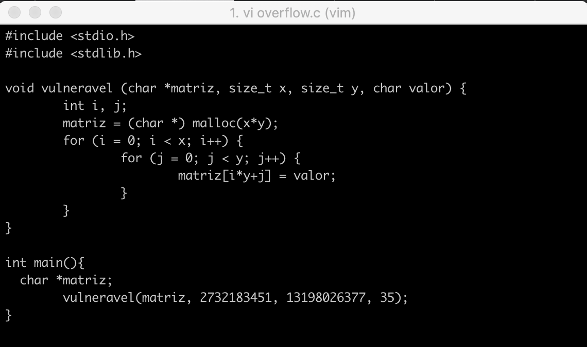
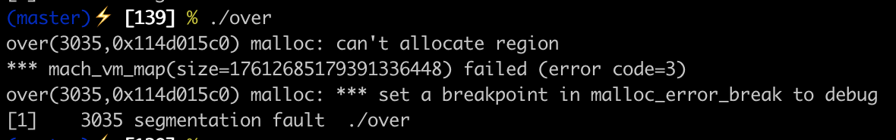
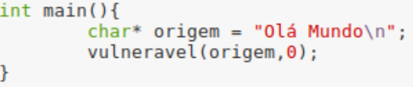

# Vulnerabilidade de inteiros

## Pegunta 1.1

### 1
A vulnerabilidade presente na função vulneravel() diz respeito aos argumentos passados, uma vez que os valores de x e y são 
size_t ou seja, correspondem a um inteiro unsigned e dizem respeito ao tamanho usado na alocação de memória da matriz. Assim, 
ao chamar-se a função com valores de x ou y cujo produto exceda o limite superior deste tipo, pode acontecer que produto x*y 
computado seja ao valor real e, desta forma, alocam-se menos bytes do que o pretendido. Devido a este risco, possivelmente 
poderia-se começar a escrever e corromper os dados de locais da memória que não pré-destinados para esta função.

### 2
De modo a demonstrar a vulnerabilidade acima apresentada, foi alterada a main:
```
int main(){
  char *matriz;
	vulneravel(matriz, 2732183451, 13198026377, 35);
}
```
Neste sentido, o nosso ficheiro overflow.c fica o seguinte:

<p align="center">
    
</p>

### 3
Quando executamos o código ocorre um **Segmentation Fault** dado que não é possível a alocação de memória pretendida pois o 
número que é convertido é inferior ao que se realmente se pretende como tamanho. Isto fará com que se tente alterar pedaços de 
memórias que não está alocada. 
Na imagem é possível ver o erro ocorrido na execução:

<p align="center">
    
</p>

## Pegunta 1.2

### 1

A vulnerabilidade presente nesta função diz respeito ao tamanho passado como argumento, apesar de se garantir que o intervalo do valor `tamanho` é entre 0 e MAX_SIZE o que previne alocar grandes quantidades de memória. A variável `tamanho_real`, é do mesmo tipo da variável `tamanho`, pode ter valores muitos grandes devido ao facto de resultar da operação `tamanho-1`. Caso o `tamanho` seja igual a 0
verifica-se um **underflow** uma vez que o tipo de dados `size_t` não tem representação de números negativos.

###2

De modo a demonstrar a vulnerabilidade acima apresentada, foi alterada a main bastando passar o argumento `tamanho` com o valor 0:

<p align="center">
    
</p>

###3

Quando executamos o código ocorre um **Segmentation Fault** dado que não é possível a alocação de memória pretendida, devolvendo NULL como resultado. O comando `memcpy` tenta escrever na variável destino que tem valor NULL, desencadeando sempre o erro de Segmentation fault.

###4
